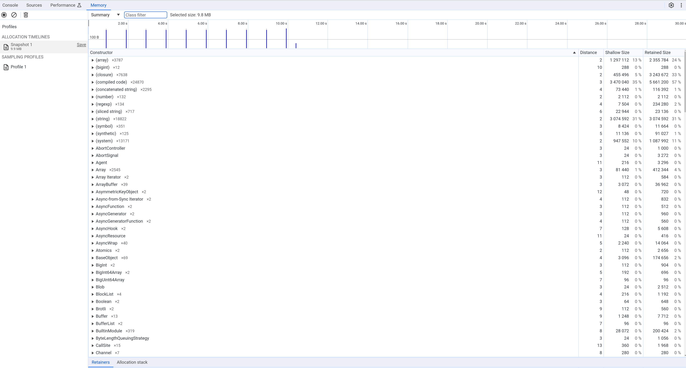
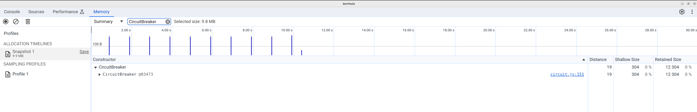

### Disable stats by doing
```js
const options = {
  timeout: 3000,
  errorThresholdPercentage: 50,
  resetTimeout: 30000,
  enableSnapshots: false,
  rollingPercentilesEnabled: false
};
const breaker = new CircuitBreaker(asyncFunctionThatCouldFail, options);
```

### Profiling looks promissing - no stats

1. It;s 99% idle, looks much better.
2. No status on the list
</img>

Heapdump shows just 1 instance of the breaker...
</img>
</img>